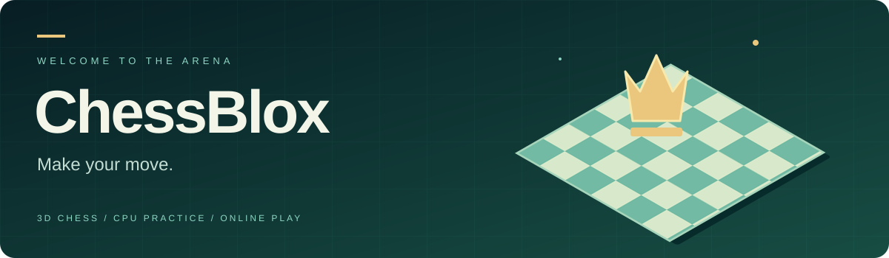
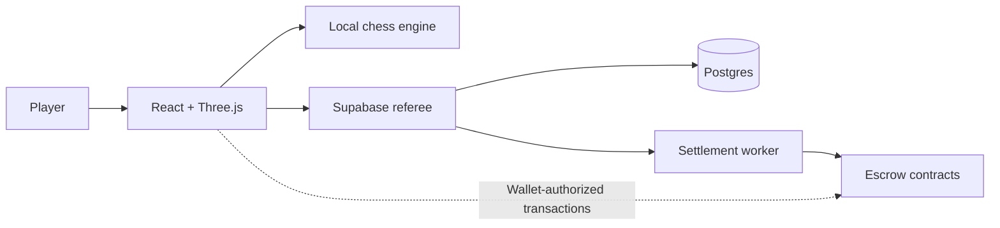

<div align="center">



**A floating chess arena. A familiar game. A little more character.**

[](https://github.com/ChessBloxArena/Chess-Arena/actions/workflows/ci.yml)
[](https://github.com/ChessBloxArena/Chess-Arena/actions/workflows/identity-guard.yml)


[**Play the preview ↗**](https://public-preview-public-preview.up.railway.app) · [Get started](#get-started) · [Deployment](docs/public/deployment.md) · [Contributing](CONTRIBUTING.md) · [Security](SECURITY.md)

</div>

---

ChessBlox brings classic chess into an animated 3D world: emerald courtyards, block characters, floating clouds, and an original soundtrack. Practice against the CPU or connect an independently configured backend for online matches.

The public Railway preview supports CPU practice. Online play and wallet-backed features require backend configuration; real-money entry is disabled in the preview.

## Inside the arena

| Experience | Details |
| :--- | :--- |
| **Play your way** | Local and CPU chess, difficulty settings, legal-move highlights, promotion, and move history. |
| **A world with character** | Emerald Garden board, animated pieces, distinct movement and defeat poses, music, and sound effects. |
| **Stay in control** | Orbit, lock, and reset the camera; responsive layouts and reduced-motion support. |
| **Meet across the board** | Referee-backed online play, invitations, quick chat, connection feedback, and leaderboards with Supabase. |
| **Inspect the infrastructure** | Escrow contracts, wallet recovery, settlement workers, and gated automatic-payout code are included for development and review. |

## Get started

Use **Node.js 22** and npm. The npm lockfile is authoritative.

```sh
git clone https://github.com/ChessBloxArena/Chess-Arena.git
cd Chess-Arena
npm run setup:anonymous-git
npm run setup:security
npm ci
npm run dev
```

Open [localhost:8080](http://localhost:8080). CPU practice works without a wallet or backend credentials. Identity setup uses the signed-in GitHub CLI account's noreply address; without `gh`, set `GITHUB_NOREPLY_EMAIL` to your GitHub noreply address first. Security setup installs a checksum-verified Gitleaks binary inside the ignored `.local/` directory.

For online features, copy `.env.example` to `.env.local` and configure your own Supabase project. `VITE_*` values are compiled into the browser bundle: use only public configuration and publishable keys. Keep signing keys, service-role credentials, and other secrets on the server.

## Architecture



| Directory | Purpose |
| :--- | :--- |
| `src/` | React application, chess rules, wallet clients, and tests. |
| `public/` | Runtime artwork, models, music, and attribution. |
| `supabase/` | Referee functions and database migrations. |
| `contracts/` · `programs/` | EVM contracts and legacy Solana escrow source. |
| `scripts/` | Service entrypoints, verification tools, and publication guards. |
| `docs/public/` | Curated documentation safe for public distribution. |

## Quality checks

```sh
npm run test:guards              # Publication and identity regression tests
npm run lint
npm test                        # Includes local-chain contract tests
npm run build                   # TypeScript checks + production bundle
npm run test:deploy              # Production server HTTP smoke tests
npm run supabase:functions:check # Requires Deno 2
```

GitHub Actions runs these checks on pushes and pull requests. Secret and publication checks also inspect outgoing history. See the workflow badges for the latest results; a passing build does not certify a live financial deployment.

## Deploy on Railway

The web service uses `railway.toml`: Railpack builds the app, `npm start` serves the production bundle, and `/health` verifies readiness. Direct game links use an SPA fallback.

Follow the [deployment guide](docs/public/deployment.md) for preview setup, backend prerequisites, worker separation, and verification. Build-time configuration must be set before deploying. Keep wager and automatic-payout flags disabled until the corresponding backend and contracts are verified.

## Publication and provenance

This repository was imported from a working source export on **September 13, 2026**. Its initial commits are a **reconstructed, backdated sequence** organized by development area across June–September 2026 to represent the project's development period. They are not recovered original commits or independently verified historical release snapshots. The final import is the tested source checkpoint.

Internal operations notes, production evidence, recordings, export bundles, and local configuration remain outside the public repository. Pseudonymous commit guards, staged-file checks, Gitleaks, and GitHub push protection reduce accidental disclosure; review remains necessary. See [SECURITY.md](SECURITY.md).

## Attribution and rights

Third-party model attribution is preserved in [public/models/colosseum-attribution.txt](public/models/colosseum-attribution.txt). No repository-wide open-source license has been granted. Public visibility does not itself grant permission to redistribute the code or artwork.
